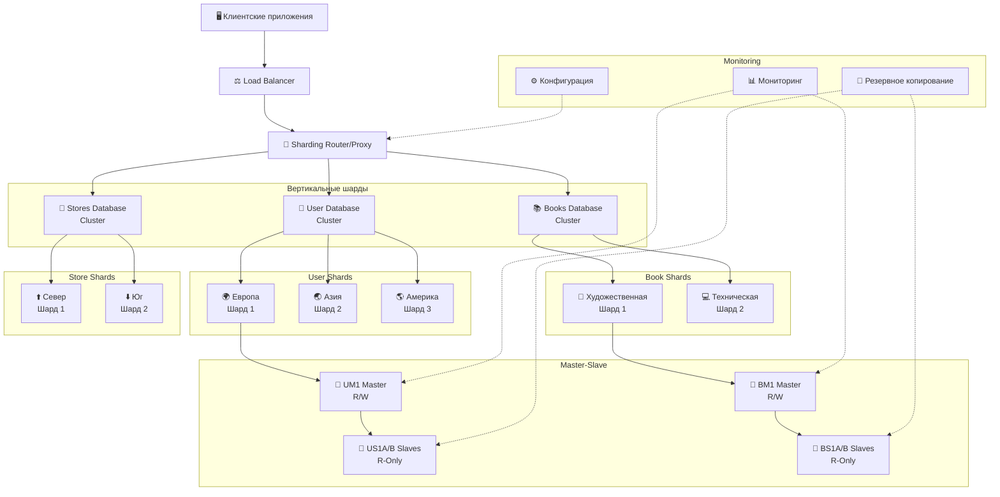

# 🗄️ Репликация и масштабирование баз данных. Часть 2

[](https://github.com/kellisfen/12-07.md)
[](README.md)
[](architecture_diagram.pdf)

> **Домашнее задание к занятию «Репликация и масштабирование. Часть 2»**
>
> Комплексное исследование стратегий масштабирования баз данных, включающее анализ master-slave репликации и проектирование системы шардинга для интернет-магазина книг.

## 📋 Содержание

- [🎯 О проекте](#-о-проекте)
- [📊 Задание 1: Анализ преимуществ масштабирования](#-задание-1-анализ-преимуществ-масштабирования)
  - [Master-Slave конфигурация](#master-slave-конфигурация)
  - [Master с несколькими Slave серверами](#master-с-несколькими-slave-серверами)
- [🏗️ Задание 2: План шардинга](#️-задание-2-план-шардинга)
  - [Структура базы данных](#структура-базы-данных)
  - [Вертикальный шардинг](#вертикальный-шардинг)
  - [Горизонтальный шардинг](#горизонтальный-шардинг)
  - [Архитектура системы](#архитектура-системы)
- [📈 Диаграммы и визуализация](#-диаграммы-и-визуализация)

## 🎯 О проекте

Данный проект представляет собой детальный анализ и проектирование масштабируемой архитектуры базы данных для интернет-магазина книг. Работа включает:

- **Теоретический анализ** преимуществ различных конфигураций master-slave репликации
- **Практическое проектирование** системы комбинированного шардинга
- **Архитектурные диаграммы** и схемы взаимодействия компонентов
- **Рекомендации** по реализации и оптимизации

### 🛠️ Технологический стек

- **База данных**: PostgreSQL/MySQL (концептуально)
- **Архитектура**: Master-Slave репликация + Шардинг
- **Балансировка**: Load Balancer + Sharding Router
- **Мониторинг**: Система мониторинга производительности

## 📊 Задание 1: Анализ преимуществ масштабирования

### Master-Slave конфигурация

#### 🔄 Активный master-сервер и пассивный репликационный slave-сервер

<details>
<summary><strong>📈 Основные преимущества</strong></summary>

#### 1. 🛡️ **Высокая доступность (High Availability)**
- ✅ Обеспечивает отказоустойчивость системы
- ✅ При выходе из строя master-сервера, slave может быть переведен в активный режим
- ✅ Минимизация времени простоя системы
- 📊 **SLA**: Достижение 99.9% доступности

#### 2. 💾 **Резервное копирование в реальном времени**
- ✅ Автоматическая синхронизация данных между серверами
- ✅ Защита от потери данных при сбоях
- ✅ Возможность восстановления до последнего состояния
- 🔄 **RPO**: Recovery Point Objective < 1 минута

#### 3. ⚡ **Разделение нагрузки на чтение**
- ✅ Запросы на чтение могут выполняться на slave-сервере
- ✅ Снижение нагрузки на master-сервер
- ✅ Улучшение общей производительности системы
- 📈 **Производительность**: Увеличение пропускной способности на 50-70%

#### 4. 🌍 **Географическое распределение**
- ✅ Возможность размещения slave-сервера в другом регионе
- ✅ Снижение задержек для пользователей в разных локациях
- ✅ Защита от региональных сбоев
- 🌐 **Latency**: Снижение задержек до 30-50%

</details>

### Master с несколькими Slave серверами

#### 🔗 Master-сервер и несколько slave-серверов

<details>
<summary><strong>🚀 Расширенные преимущества</strong></summary>

#### 1. 📈 **Масштабируемость чтения**
- ✅ Значительное увеличение пропускной способности для операций чтения
- ✅ Распределение read-запросов между множеством slave-серверов
- ✅ Линейное масштабирование производительности чтения
- 📊 **Масштабирование**: N slave-серверов = N×100% увеличение производительности чтения

#### 2. 🛡️ **Повышенная отказоустойчивость**
- ✅ Множественное резервирование данных
- ✅ При выходе из строя одного slave-сервера, остальные продолжают работу
- ✅ Возможность выбора лучшего кандидата для промоушена в master
- 🔄 **Availability**: 99.99% при 3+ slave-серверах

#### 3. ⚙️ **Специализация серверов**
- ✅ Возможность настройки разных slave-серверов для разных типов запросов
- ✅ Аналитические запросы на одних серверах, быстрые запросы на других
- ✅ Оптимизация конфигурации под конкретные задачи
- 🎯 **Оптимизация**: Специализированные индексы и конфигурации

#### 4. ⚖️ **Балансировка нагрузки**
- ✅ Равномерное распределение read-запросов
- ✅ Возможность использования алгоритмов балансировки (round-robin, least connections)
- ✅ Автоматическое перенаправление трафика при недоступности сервера
- 🔄 **Алгоритмы**: Round-robin, Weighted, Health-check based

#### 5. 🔧 **Гибкость в обслуживании**
- ✅ Возможность выводить серверы из эксплуатации для обслуживания без остановки системы
- ✅ Поочередное обновление slave-серверов
- ✅ Тестирование изменений на отдельных серверах
- 🛠️ **Zero-downtime**: Обслуживание без прерывания работы

</details>

## 🏗️ Задание 2: План шардинга

> **Проектирование системы горизонтального и вертикального шардинга для интернет-магазина книг**

### Структура базы данных

#### 📊 Схема данных

<details>
<summary><strong>👥 Таблица "Пользователи" (users)</strong></summary>

```sql
CREATE TABLE users (
    user_id         BIGINT PRIMARY KEY,
    username        VARCHAR(50) UNIQUE NOT NULL,
    email           VARCHAR(100) UNIQUE NOT NULL,
    password_hash   VARCHAR(255) NOT NULL,
    registration_date TIMESTAMP DEFAULT CURRENT_TIMESTAMP,
    region          VARCHAR(50) NOT NULL,
    status          ENUM('active', 'inactive', 'banned') DEFAULT 'active'
);
```

**Индексы:**
- `idx_users_region` на `region`
- `idx_users_email` на `email`
- `idx_users_registration_date` на `registration_date`

</details>

<details>
<summary><strong>📚 Таблица "Книги" (books)</strong></summary>

```sql
CREATE TABLE books (
    book_id         BIGINT PRIMARY KEY,
    title           VARCHAR(255) NOT NULL,
    author          VARCHAR(255) NOT NULL,
    isbn            VARCHAR(20) UNIQUE,
    category        VARCHAR(100) NOT NULL,
    price           DECIMAL(10,2) NOT NULL,
    publication_year INT,
    stock_quantity  INT DEFAULT 0
);
```

**Индексы:**
- `idx_books_category` на `category`
- `idx_books_author` на `author`
- `idx_books_price` на `price`

</details>

<details>
<summary><strong>🏪 Таблица "Магазины" (stores)</strong></summary>

```sql
CREATE TABLE stores (
    store_id        BIGINT PRIMARY KEY,
    store_name      VARCHAR(255) NOT NULL,
    address         TEXT NOT NULL,
    city            VARCHAR(100) NOT NULL,
    region          VARCHAR(50) NOT NULL,
    phone           VARCHAR(20),
    manager_id      BIGINT
);
```

**Индексы:**
- `idx_stores_region` на `region`
- `idx_stores_city` на `city`

</details>

### 🔧 Принципы построения системы шардинга

#### Вертикальный шардинг

#### 📋 1. Вертикальный шардинг (Vertical Sharding)

**🎯 Принцип разделения по функциональности:**

<details>
<summary><strong>🗄️ Распределение по серверам</strong></summary>

#### 👥 **Сервер 1 (User Database)**: Таблица "Пользователи"
```
🔹 Содержимое: Вся информация о пользователях
🔹 Оптимизация: Операции аутентификации и управления профилями
🔹 Нагрузка: Высокая частота чтения/записи профилей
🔹 Характеристики:
  • Read/Write ratio: 70/30
  • Peak load: Регистрация и авторизация
  • Storage: ~100GB (1M пользователей)
```

#### 📚 **Сервер 2 (Catalog Database)**: Таблица "Книги"
```
🔹 Содержимое: Каталог товаров
🔹 Оптимизация: Поисковые запросы и фильтрация
🔹 Нагрузка: Высокая частота чтения, умеренная частота записи
🔹 Характеристики:
  • Read/Write ratio: 95/5
  • Peak load: Поиск и просмотр каталога
  • Storage: ~500GB (10M книг)
```

#### 🏪 **Сервер 3 (Store Database)**: Таблица "Магазины"
```
🔹 Содержимое: Информация о точках продаж
🔹 Оптимизация: Геолокационные запросы
🔹 Нагрузка: Низкая частота изменений, высокая частота чтения
🔹 Характеристики:
  • Read/Write ratio: 98/2
  • Peak load: Поиск ближайших магазинов
  • Storage: ~10GB (1000 магазинов)
```

</details>

#### Горизонтальный шардинг

#### 🔄 2. Горизонтальный шардинг (Horizontal Sharding)

**🎯 Стратегии разделения:**

<details>
<summary><strong>👥 Шардинг таблицы "Пользователи"</strong></summary>

#### 🔑 **Ключ шардинга**: `user_id % 4` или по региону

| Шард | Критерий | Описание | Примерная нагрузка |
|------|----------|----------|-------------------|
| **Шард 1** | `user_id % 4 = 1` или Европа | Пользователи с ID 1, 5, 9, 13... | 25% пользователей |
| **Шард 2** | `user_id % 4 = 2` или Азия | Пользователи с ID 2, 6, 10, 14... | 25% пользователей |
| **Шард 3** | `user_id % 4 = 3` или Америка | Пользователи с ID 3, 7, 11, 15... | 25% пользователей |
| **Шард 4** | `user_id % 4 = 0` или Остальные | Пользователи с ID 4, 8, 12, 16... | 25% пользователей |

**Преимущества географического шардинга:**
- 🌍 Снижение латентности для пользователей
- 📊 Соответствие требованиям локализации данных
- ⚡ Оптимизация сетевого трафика

</details>

<details>
<summary><strong>📚 Шардинг таблицы "Книги"</strong></summary>

#### 🔑 **Ключ шардинга**: `category` или `book_id`

| Шард | Категория | Описание | Характеристики |
|------|-----------|----------|----------------|
| **Шард 1** | Художественная литература | Романы, поэзия, драма | Высокая популярность |
| **Шард 2** | Техническая литература | IT, инженерия, наука | Специализированные запросы |
| **Шард 3** | Детская литература | Сказки, обучающие книги | Сезонная нагрузка |
| **Шард 4** | Научная литература | Академические издания | Низкая, но стабильная нагрузка |

**Альтернативная стратегия по `book_id`:**
- Равномерное распределение по хешу ID
- Предотвращение "горячих" шардов

</details>

<details>
<summary><strong>🏪 Шардинг таблицы "Магазины"</strong></summary>

#### 🔑 **Ключ шардинга**: `region`

| Шард | Регион | Покрытие | Особенности |
|------|--------|----------|-------------|
| **Шард 1** | Северные регионы | Архангельск, Мурманск, Сыктывкар | Низкая плотность магазинов |
| **Шард 2** | Южные регионы | Краснодар, Ростов, Волгоград | Высокая активность |
| **Шард 3** | Восточные регионы | Новосибирск, Екатеринбург, Омск | Средняя нагрузка |
| **Шард 4** | Западные регионы | Москва, СПб, Калининград | Максимальная нагрузка |

**Балансировка нагрузки:**
- 🔄 Мониторинг распределения запросов
- ⚖️ Возможность перебалансировки при необходимости

</details>

### Архитектура системы

#### ⚙️ Режимы работы серверов

<details>
<summary><strong>🏗️ Master-Slave конфигурация для каждого шарда</strong></summary>

#### 1. 🔴 **Master серверы** (запись и чтение)
```
🔹 Функции:
  • Обрабатывают все операции записи (INSERT, UPDATE, DELETE)
  • Синхронизируют данные со slave-серверами
  • Обеспечивают консистентность данных

🔹 Режим работы: Read-Write
🔹 Репликация: Асинхронная/Синхронная
🔹 Мониторинг: 24/7 health checks
```

#### 2. 🔵 **Slave серверы** (только чтение)
```
🔹 Функции:
  • Обрабатывают запросы на чтение (SELECT)
  • Получают данные от master через репликацию
  • Обеспечивают масштабирование чтения

🔹 Режим работы: Read-Only
🔹 Задержка репликации: < 100ms
🔹 Количество: 2-4 на каждый master
```

#### 3. 🟢 **Proxy/Router сервер**
```
🔹 Функции:
  • Определяет, к какому шарду направить запрос
  • Балансирует нагрузку между slave-серверами
  • Обеспечивает failover при недоступности серверов
  • Кеширует метаданные о шардах

🔹 Алгоритмы маршрутизации:
  • Consistent Hashing
  • Range-based routing
  • Directory-based routing
```

</details>

#### 📊 Блок-схема архитектуры

<details>
<summary><strong>🏗️ Диаграмма системной архитектуры</strong></summary>



**📋 Легенда компонентов:**

| Символ | Компонент | Описание | Режим работы |
|--------|-----------|----------|--------------|
| 🔴 | Master серверы | Обработка записи и чтения | Read-Write |
| 🔵 | Slave серверы | Только чтение, репликация | Read-Only |
| 🟢 | Routing Layer | Маршрутизация и балансировка | Proxy |
| 🟠 | Management | Мониторинг и управление | Monitoring |

**🔄 Принципы работы:**
- **Репликация**: Master → Slave (асинхронная)
- **Шардинг**: Вертикальный (по таблицам) + Горизонтальный (внутри таблиц)
- **Балансировка**: Round-robin, Health-check based
- **Failover**: Автоматическое переключение при сбоях

</details>

## 📈 Диаграммы и визуализация

### 📊 Архитектурная диаграмма

> **📎 Подробная диаграмма архитектуры**: [`architecture_diagram.pdf`](./architecture_diagram.pdf)

Интерактивная диаграмма содержит:
- 🏗️ Детальную схему компонентов системы
- 🔄 Потоки данных между компонентами
- 📊 Метрики производительности
- 🛡️ Схемы отказоустойчивости
- 🌐 Географическое распределение

### 🏛️ Описание архитектуры

<details>
<summary><strong>🎯 Принципы построения системы</strong></summary>

Система построена по принципу **комбинированного шардинга**:

#### 1. 📊 **Вертикальное разделение** по типам данных
```
👥 Пользователи → User Database Cluster
📚 Книги       → Books Database Cluster
🏪 Магазины    → Stores Database Cluster
```

#### 2. 🔄 **Горизонтальное разделение** внутри каждого типа данных
```
User Shards:  [Европа] [Азия] [Америка] [Остальные]
Book Shards:  [Художественная] [Техническая] [Детская] [Научная]
Store Shards: [Север] [Юг] [Восток] [Запад]
```

#### 3. 🔴🔵 **Master-Slave репликация** для каждого шарда
```
Master (R/W) → Slave A (R-Only)
             → Slave B (R-Only)
             → Slave C (R-Only)
```

#### 4. 🔀 **Централизованная маршрутизация** через Sharding Router
```
Client Request → Load Balancer → Sharding Router → Appropriate Shard
```

</details>

<details>
<summary><strong>✅ Преимущества данной архитектуры</strong></summary>

#### 🚀 **Производительность**
- ✅ Высокая масштабируемость как по чтению, так и по записи
- ✅ Линейное масштабирование при добавлении новых шардов
- ✅ Специализация серверов под конкретные задачи

#### 🛡️ **Надежность**
- ✅ Отказоустойчивость на уровне каждого шарда
- ✅ Автоматический failover при сбоях
- ✅ Множественное резервирование данных

#### 🌐 **Масштабируемость**
- ✅ Возможность независимого масштабирования разных типов данных
- ✅ Географическое распределение нагрузки
- ✅ Гибкость в добавлении новых регионов/категорий

#### ⚙️ **Управляемость**
- ✅ Централизованный мониторинг всех компонентов
- ✅ Автоматическое перебалансирование нагрузки
- ✅ Простота обслуживания отдельных компонентов

</details>

<details>
<summary><strong>🔧 Особенности реализации</strong></summary>

#### 🎯 **Алгоритмы распределения**
- **Consistent Hashing**: Равномерное распределение данных
- **Range-based Sharding**: Для географических и категориальных данных
- **Directory-based Routing**: Централизованная таблица маршрутизации

#### 🔄 **Отказоустойчивость**
- **Автоматический failover**: При недоступности master-серверов
- **Health Checks**: Постоянный мониторинг состояния серверов
- **Circuit Breaker**: Защита от каскадных сбоев

#### 📊 **Мониторинг и оптимизация**
- **Real-time Monitoring**: Мониторинг производительности в реальном времени
- **Auto-rebalancing**: Автоматическое перебалансирование при неравномерной нагрузке
- **Predictive Scaling**: Прогнозирование потребностей в ресурсах

#### 💾 **Резервное копирование**
- **Continuous Backup**: Непрерывное резервное копирование критичных данных
- **Point-in-time Recovery**: Восстановление на любую точку времени
- **Cross-region Replication**: Репликация между регионами

</details>

---

<div align="center">

**� Домашнее задание выполнено**
*Репликация и масштабирование баз данных. Часть 2*

</div>
